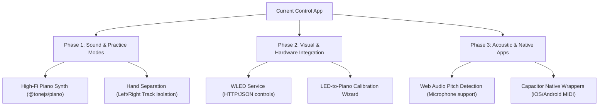

# Competitor Analysis: MuseTrainer & PianoPlay

This report examines two open-source piano/practice web applications—**MuseTrainer** (Piano Trainer Studio) and Rodrigo Vilar's **PianoPlay**—comparing their architectures and features with our `alphaTab`-based application. It identifies high-value features and technical solutions we can adapt to enhance our practice platform.

---

## 🔎 Technical Discoveries from Source Code

By cloning and inspecting the source code of both repositories, we have uncovered their exact implementation strategies for MIDI tracking and sound synthesis:

### 1. MuseTrainer: MIDI Note Tracking & Strict Matching
In MuseTrainer's `notes.service.ts` (located under `src/app/notes.service.ts`), the application manages note states using key-value maps:
* **`mapPressed`**: Holds keys currently pressed by the user (MIDI number -> press state count).
* **`mapRequired`**: Holds keys required by the current cursor beat.
* **Matching Logic (`isRequiredNotesPressed`)**:
  * It verifies if all notes marked as "new" (value = 0) in the required map exist in the pressed map.
  * It implements a **strict check** where if any pressed key is not in the required map, it immediately returns `false` (prevents skipping/cheating).
  * Tied notes are automatically handled by initializing their state as "already pressed" (value = 1) if they are a continuation of a tie.
* **Cursor Advance:** In `play.page.ts`, any MIDI `noteOn` or `noteOff` updates the pressed map and immediately queries `notesService.isRequiredNotesPressed()`. If true, it advances the OpenSheetMusicDisplay cursor (`osmdCursorPlayMoveNext()`).

### 2. PianoPlay: Tone.js Multi-Sampled Synthesizer
In PianoPlay's `home.page.ts` (located under `src/app/home/home.page.ts`), Rodrigo Vilar integrates high-quality piano audio:
* **Memory Optimization:** Rather than loading the full grand piano multi-sample set (which is huge), they instantiate `@tonejs/piano` with a single velocity layer:
  ```typescript
  this.piano = new Piano({
    velocities: 1, // Restricts velocity steps to 1 to reduce download size & memory
  });
  this.piano.toDestination();
  this.piano.load();
  ```
* **Triggering Notes:** When a note needs to be heard, it simply calls:
  ```typescript
  this.piano.keyDown({ midi: pitch });
  ```
  And releases it with `this.piano.keyUp({ midi: pitch })`. This gives an authentic Salamander Grand Piano tone.

---

## Feature Comparison Matrix

| Feature | Our App (`alphaTab` Playground) | MuseTrainer (`musetrainer/source`) | PianoPlay (`rvilarl/pianoplay`) |
| :--- | :--- | :--- | :--- |
| **Notation Rendering** | **alphaTab Engine** (Highly optimized SVG/Canvas, supports guitar tabs & standard notation) | **OpenSheetMusicDisplay (OSMD)** & **VexFlow** (Strictly MusicXML/MXL) | **OpenSheetMusicDisplay (OSMD)** & **VexFlow** (Strictly MusicXML/MXL) |
| **Audio Synthesis** | Built-in alphaTab Soundfont Synthesizer | MIDI output & basic browser synth | **Tone.js & `@tonejs/piano`** (Multi-sampled Salamander Grand Piano) |
| **MIDI Interface** | Web MIDI API (Chrome/Edge/Opera only) | Web MIDI + **Capacitor Native MIDI plugin** (iOS/Android) | Web MIDI API |
| **Practice Modes** | **Step Practice** (Wait-for-note) & **Perform** (Realtime timing analyzer) | **Realtime**, **Wait for Me**, **Follow Me** (Duet/Hand practice) | **Wait-for-note** (Follows progress on score) |
| **Pitch Detection** | ❌ None | **Capacitor Pitch Detection plugin** (Microphone practice for acoustic pianos) | ❌ None |
| **Hardware Visuals** | ❌ None (Virtual keyboard only) | **WLED Integration** (Wi-Fi connected LED strip above piano keys, JSON/DDP protocols) | ❌ None |
| **Platform Target** | Web | Web, iOS, Android (via Ionic & Capacitor) | Web (via Ionic & Angular) |

---

## 💡 Concrete Solutions we can Adopt in alphaTab

### 1. High-Fidelity Audio: Tone.js & `@tonejs/piano` Integration
* **The Solution:** While alphaTab's built-in Soundfont player is extremely light and convenient, it lacks acoustic richness. We can import `@tonejs/piano` to play multi-sampled notes.
* **Why it matters:** It utilizes the Salamander Grand Piano sample set (up to 16 velocity layers per key, sustain pedal physics, and release string resonance), offering a premium, concert-grand piano sound.
* **Implementation:** Add an option in the audio settings to toggle between "Standard Synthesizer (Soundfont)" and "High-Fidelity Concert Grand (ToneJS)". We can load the 1-velocity layer to maintain fast load times, as done in PianoPlay.

### 2. Smart Practice: "Follow Me" (Hand & Track Selection)
* **The Solution:** Implement a track/hand selection option. 
* **Why it matters:** Piano players frequently practice one hand at a time. In "Follow Me" mode, the player plays the accompaniment (e.g., the left-hand track) while the system pauses and waits for the user to play the melody (e.g., the right-hand track).
* **Implementation:** Use alphaTab's track system to mute the user-practiced track from the synthesizer and pass the notes of that track to the `PracticeSession` queue, while playing other tracks normally.

### 3. Acoustic Support: Web Audio API Pitch Detection
* **The Solution:** Add microphone-based pitch detection using a library like `pitchy` or autocorrelation algorithms in TypeScript/JavaScript.
* **Why it matters:** Many users play acoustic pianos or keyboards without MIDI outputs. Pitch detection listens to their play through the microphone, matching acoustic pitches to the sheet music notes.
* **Implementation:** Create an `AudioInputService` alongside our `MidiInputService` that uses `getUserMedia` to capture mic input, extract fundamental frequencies, map them to MIDI numbers, and feed them directly to our existing `PracticeSession`.

### 4. Interactive Learning: WLED strip Integration
* **The Solution:** Integrate support for WLED-controlled LED strips (such as WS2812B strips attached to a Wi-Fi-enabled ESP32 controller placed above the keys).
* **Why it matters:** A light-up keyboard guides beginners through complex passages and visualizes the score in physical space.
* **Implementation:**
  * **HTTP JSON Mode:** Send HTTP POST requests to `http://[wled-ip]/json/state` with pixel colors matching the keys corresponding to the `currentItem` in our practice queue.
  * **DDP (Device Destination Protocol) / UDP:** For real-time, low-latency performance, send raw UDP binary packages mapping MIDI note numbers to specific LED index colors (after calibration).
  * **Calibration UI:** Create a simple tool in settings where the user presses the lowest key and the highest key to map MIDI notes (e.g., 21 to 108) to LED indices.

### 5. Cross-Platform Wrapper: Capacitor Integration
* **The Solution:** Use Capacitor to build native iOS, Android, and desktop versions of our playground.
* **Why it matters:** Web MIDI is heavily restricted or non-functional in iOS Safari. A wrapper with Capacitor allows using native MIDI APIs via plugins (`capacitor-musetrainer-midi` or similar) to ensure seamless device connectivity.

---

## 🛠️ Proposed Implementation Roadmap


