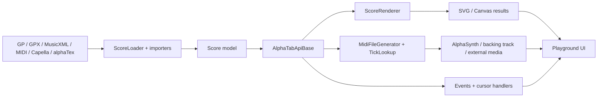

# Архитектура

## Основной поток

## Загрузка и модель

`ScoreLoader` получает URL, бинарные данные или alphaTex. Для бинарных данных он последовательно пробует импортёры из `Environment.buildImporters()`, пока один не создаст `Score`.

`Score` — корень модели. После загрузки `AlphaTabApiBase` применяет pitch offsets, выбирает отображаемые треки, публикует `scoreLoaded`, генерирует MIDI и запускает рендеринг.

Ключевые файлы:

- `packages/alphatab/src/importer/ScoreLoader.ts`
- `packages/alphatab/src/model/Score.ts`
- `packages/alphatab/src/AlphaTabApiBase.ts`

## Рендеринг

`ScoreRenderer` выбирает canvas factory и layout factory через `Environment`. Рендер может выполняться локально или в worker в зависимости от settings и возможностей платформы.

`BoundsLookup` связывает элементы модели с координатами отображения. После рендера он используется для hit testing, selection, курсоров и practice overlay.

Ключевые файлы:

- `packages/alphatab/src/rendering/ScoreRenderer.ts`
- `packages/alphatab/src/rendering/layout/`
- `packages/alphatab/src/rendering/glyphs/`
- `packages/alphatab/src/rendering/utils/BoundsLookup.ts`

## MIDI и звук

`MidiFileGenerator` проходит по модели и создаёт MIDI events, sync points, transposition data и tick lookup. `AlphaTabApiBase.loadMidiForScore()` передаёт результат активному player backend.

AlphaSynth разделён на sequencer, synthesizer и platform output. В браузере тяжёлая работа может выполняться через Web Worker, а вывод — через AudioWorklet.

Ключевые файлы:

- `packages/alphatab/src/midi/MidiFileGenerator.ts`
- `packages/alphatab/src/midi/AlphaSynthMidiFileHandler.ts`
- `packages/alphatab/src/synth/AlphaSynth.ts`
- `packages/alphatab/src/synth/MidiFileSequencer.ts`
- `packages/alphatab/src/platform/worker/`
- `packages/alphatab/src/platform/javascript/AlphaSynthAudioWorkletOutput.ts`

## API как координационный слой

UI должен работать через `AlphaTabApi`: settings, `load`, `renderTracks`, `play`, `stop`, playback range, track mute/solo/volume/transposition и события жизненного цикла.

Важно: простое изменение `api.settings` не применяется автоматически. Требуются `updateSettings()` и, когда нужно, `render()` или повторная генерация MIDI.

Связанные заметки: [[03 Playground and Practice]], [[04 Package Map]], [[Glossary]].
