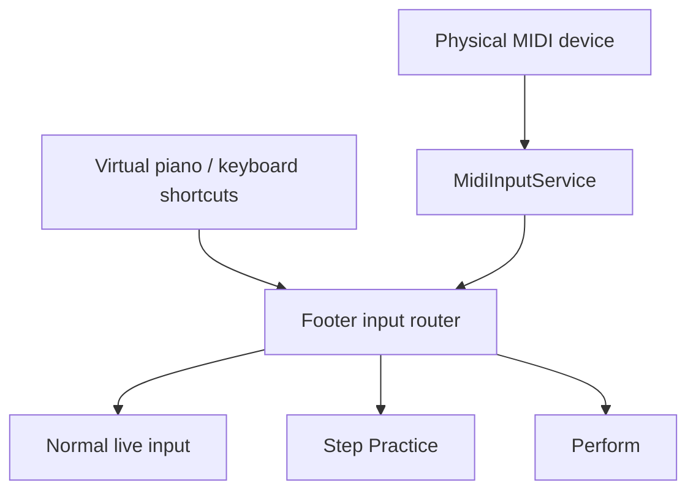

# Playground, MIDI и practice modes

## UI-композиция

`ControlApp` создаёт detached DOM, `AlphaTabApi` и верхнеуровневые компоненты. Компоненты используют явный контракт:

- конструктор получает API и options;
- `.root` монтируется владельцем;
- методы обеспечивают parent-to-child updates;
- callback fields или event emitters обеспечивают child-to-parent events;
- `dispose()` освобождает API subscriptions, DOM listeners, timers и дочерние компоненты.

В UI нет virtual DOM и глобального state manager. Источником истины остаётся `AlphaTabApi` и его события.

## MIDI routing

Один `MidiInputService` создаётся в `Footer`. Он отслеживает устройства Web MIDI, нормализует note-on/note-off и направляет события в активный режим:

## Step Practice

`buildPracticeQueue()` превращает playable beats текущих треков в упорядоченную очередь. Beats с одинаковым `startTick` объединяются в одно упражнение, поэтому ноты разных staves принимаются как единый аккорд в любом порядке. Одинаковый pitch требует одного физического нажатия, но сохраняет все source beats для подсветки. Rest beats и tie destinations пропускаются; длительность tie chain расширяет время допустимого удержания.

`PracticeSession`:

- требует точное множество удерживаемых нот;
- поддерживает аккорды в любом порядке;
- различает новую атаку и ранее удержанную ноту;
- считает лишнюю ноту ошибкой;
- может нормализовать pitch по классу при Ignore octave;
- умеет seek к ближайшему tick;
- фильтрует очередь по playback range;
- при loop возвращается к началу и ведёт clean streak/error count.

UI при правильном вводе перемещает player tick к следующему элементу, обновляет overlay и keyboard hints. Основной playback в Step Practice не должен сам продвигать упражнение.

Live MIDI channel определяется по source beat введённой ноты. Channel `0` является валидным и не используется как признак отсутствующего значения.

## Perform

`PerformSession` работает поверх реального playback:

1. `PerformPanel` строит expected items из practice queue.
2. Сохраняет playback settings и track mute/solo.
3. Добавляет lead-in, включает silent score playback, looping и метроном.
4. По `playerPositionChanged` собирает пары tick/time и проецирует expected wall timestamps.
5. MIDI note-on сопоставляется с ближайшим ожидаемым pitch внутри timing window.
6. Считаются correct, wrong, missed, early и late.
7. После заданного количества clean passes скорость увеличивается до target speed.
8. При stop выполняется `api.stop()` и полностью восстанавливается snapshot.

Loop, Ignore octave, Start speed и Target speed фиксируются на время активного прохода и снова становятся доступными после Stop/Finish. Show hints, Tempo cursor, Reset и выбор MIDI-устройства остаются доступными.

## MIDI lifecycle

`MidiInputService` учитывает активные ноты по input и pitch. Одинаковый pitch от нескольких устройств агрегируется и получает общий note-off только после освобождения последнего источника. Смена выбранного input, физическое отключение устройства и `dispose()` синтезируют недостающие note-off до снятия handlers, предотвращая зависшие live voices.

## Зоны чувствительности

- live notes и score playback используют один AlphaSynth и могут создавать двойной output;
- repeated note-on должен быть идемпотентным;
- tie/sustain требуют согласования queue, клавиатуры и подсветки нот;
- Practice и Perform используют общие keyboard hints, поэтому Footer закрывает предыдущий режим до запуска следующего;
- tempo cursor дедуплицирует source beats по staff и создаёт одну отметку для каждого затронутого staff;
- `playerPositionChanged` высокочастотный и не должен вызывать лишнюю перестройку DOM;
- settings нельзя сохранять во время временной Perform-конфигурации;
- cleanup должен останавливать все live notes и отписывать все listeners.

## Browser smoke 2026-07-14

На `MozartPianoSonata.xml` подтверждено: beats обоих staves на tick `0` образуют одно упражнение, пять уникальных pitches подсвечиваются одновременно, а Perform блокирует Loop, Ignore octave, Start speed и Target speed до Stop или закрытия панели. Show hints, Tempo cursor, Reset и MIDI input остаются доступными. Stop и закрытие панели останавливают player, очищают cursor overlay и возвращают controls в доступное состояние. Ошибок и предупреждений в browser console не было.

Первичный smoke выявил потерю keyboard hints при открытии Practice и лишнюю Tempo cursor отметку для второго voice верхнего staff. После исправления повторный smoke подтвердил, что hints появляются сразу (`45`, `73`, `76`, `81`, `85`), а стартовая группа Mozart создаёт ровно две cursor marks — по одной на верхнем и нижнем staff. Stop очищает overlay; ошибок и предупреждений в browser console нет.

Ключевые файлы:

- `packages/playground/src/apps/ControlApp.ts`
- `packages/playground/src/components/Footer.ts`
- `packages/playground/src/input/MidiInputService.ts`
- `packages/playground/src/components/PianoKeyboard.ts`
- `packages/playground/src/components/practice/PracticeController.ts`
- `packages/playground/src/components/practice/PracticePanel.ts`
- `packages/playground/src/components/practice/PerformPanel.ts`
- `packages/playground/test/PracticeController.test.ts`
