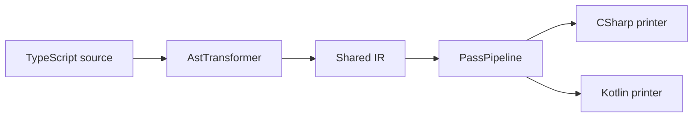

# Карта пакетов

| Пакет | Ответственность |
|---|---|
| `packages/alphatab` | Core model, import/export, rendering, MIDI, AlphaSynth, platform abstractions и публичный API. |
| `packages/playground` | Vite development harness и продуктовые UI-функции этого fork. |
| `packages/alphatex` | Центральные language definitions alphaTex и генерация облегчённых parser/LSP definitions. |
| `packages/lsp` | Language Server, TextMate grammar, completion, hover, signature help и formatter для alphaTex. |
| `packages/monaco` | Экспериментальная интеграция Monaco, TextMate и LSP web worker. |
| `packages/vite` | Копирование fonts/soundfonts и настройка Web Workers/Audio Worklets для Vite. |
| `packages/webpack` | Аналогичная bundler integration для Webpack. |
| `packages/transpiler` | TypeScript → shared IR → C#/Kotlin pipeline. |
| `packages/csharp` | C#/.NET target, build и tests. |
| `packages/kotlin` | Android/Kotlin target, Gradle build и tests. |
| `packages/tooling` | Общие инструменты разработки и генерации. |

Автоматически обновляемая версия со scripts и versions: [[_generated/Package Matrix]].

## Transpiler pipeline

Printers должны получать разрешённые types, корректные parent links, переписанные visibility/override flags и применённые target naming conventions.
